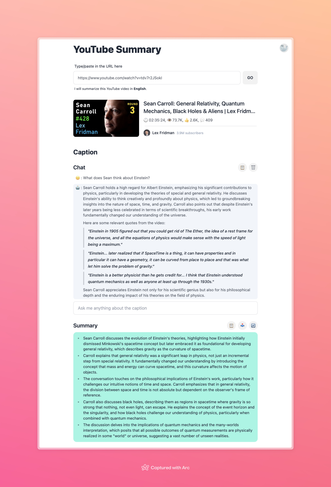

# Chat over YouTube videos



## Overview

This is a web application that allows users to generate summaries of YouTube videos. The application leverages YouTube's API to fetch video details, captions, and comments, and uses OpenAI's GPT-4 model to generate concise summaries. Users can also interact with the application through a chat interface to ask questions about the video content.

## Main Features

1. **YouTube Video Summarization**:

   - Fetches video details, captions, and comments from YouTube.
   - Generates summaries of video captions and comments using OpenAI's GPT-4 model.
   - Provides a shareable summary card for each video.

2. **User Authentication**:

   - Supports Google OAuth for user authentication.
   - Restricts access to authenticated users only.

3. **Interactive Chat**:

   - Allows users to ask questions about the video content.
   - Provides responses using the GPT-4 model, including relevant quotes from the video captions.

4. **Language Support**:
   - Supports both English and Chinese for summarization and interaction.

## High-Level Logic

### Middleware

- **`middleware.ts`**: Handles proxy requests to YouTube's API, adding the necessary API key for authentication.

### API Endpoints

- **`/api/youtube/caption.ts`**: Fetches video captions in the specified language.
- **`/api/auth/[...nextauth].ts`**: Manages user authentication using NextAuth and Google OAuth.
- **`/api/ai/chat.ts`**: Handles chat interactions, sending user messages to OpenAI's GPT-4 model and streaming responses.
- **`/api/ai/summary.ts`**: Generates summaries for video captions and comments using OpenAI's GPT-4 model.

### Components

- **YouTube Components**:

  - **`YouTubeContent.tsx`**: Main component that fetches and displays video details, captions, and comments.
  - **`YouTubeVideoCaptionSummary.tsx`**: Generates and displays the summary of video captions.
  - **`YouTubeVideoCommentsSummary.tsx`**: Generates and displays the summary of video comments.
  - **`YouTubeVideoShareCard.tsx`**: Displays a shareable card with video summary details.

- **Common Components**:
  - **`Chat.tsx`**: Chat interface for user interaction.
  - **`Header.tsx`**: Header component for setting page metadata.
  - **`URLInput.tsx`**: Input component for entering YouTube video URLs.

### Hooks

- **`useYouTubeVideoInfo.ts`**: Fetches and manages state for YouTube video details.
- **`useYouTubeVideoCaption.ts`**: Fetches and manages state for YouTube video captions.
- **`useYouTubeVideoComments.ts`**: Fetches and manages state for YouTube video comments.
- **`useYouTubeVideoCaptionSummary.ts`**: Generates summaries for video captions.
- **`useYouTubeVideoCommentsSummary.ts`**: Generates summaries for video comments.
- **`useChatContent.tsx`**: Manages chat interactions and state.
- **`useSummary.tsx`**: Manages the summarization process and state.

## Getting Started

### Prerequisites

- Node.js
- Google API Key
- OpenAI API Key

### Installation

1. Clone the repository:

   ```bash
   git clone https://github.com/m0o0scar/youtube-summary.git
   cd youtube-summary
   ```

2. Install dependencies:

   ```bash
   npm install
   ```

3. Set up environment variables:

   - Create a `.env.local` file in the root directory.
   - Add the following environment variables:
     ```
     GOOGLE_CLIENT_ID=your-google-client-id
     GOOGLE_CLIENT_SECRET=your-google-client-secret
     GOOGLE_API_KEY=your-google-api-key
     OPENAI_API_TOKEN=your-openai-api-token
     ```

4. Run the development server:

   ```bash
   npm run dev
   ```

5. Open your browser and navigate to `http://localhost:3000`.

## Contributing

Contributions are welcome! Please open an issue or submit a pull request for any improvements or bug fixes.

## License

This project is licensed under the MIT License. See the [LICENSE](LICENSE) file for details.
